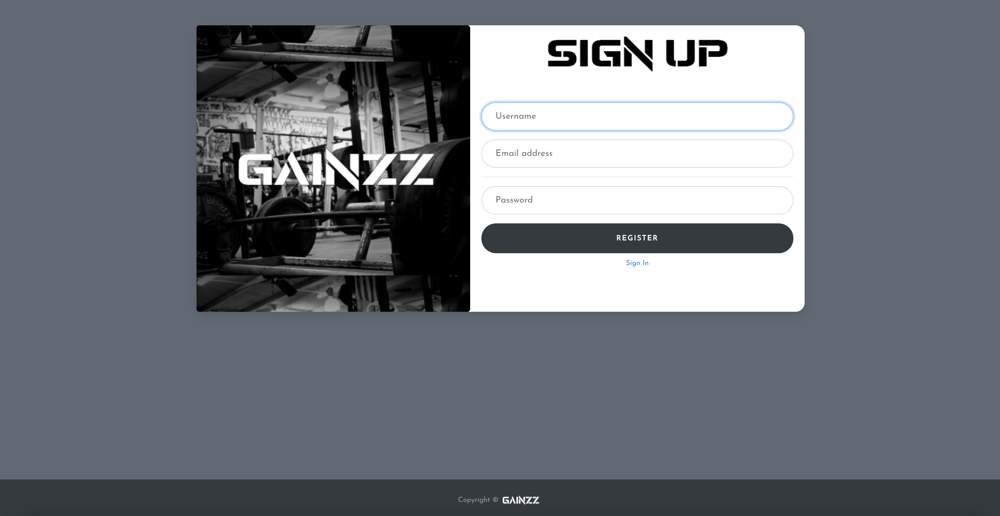
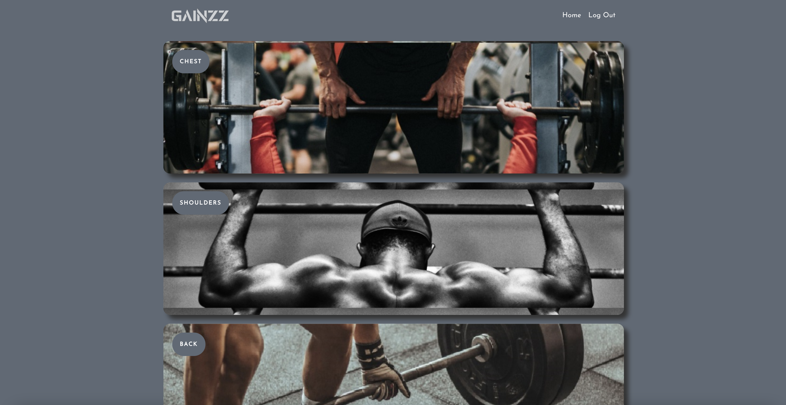
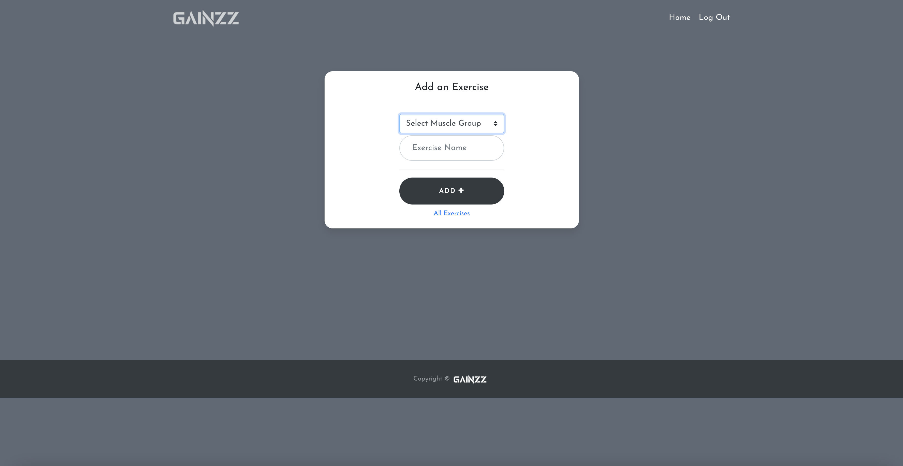
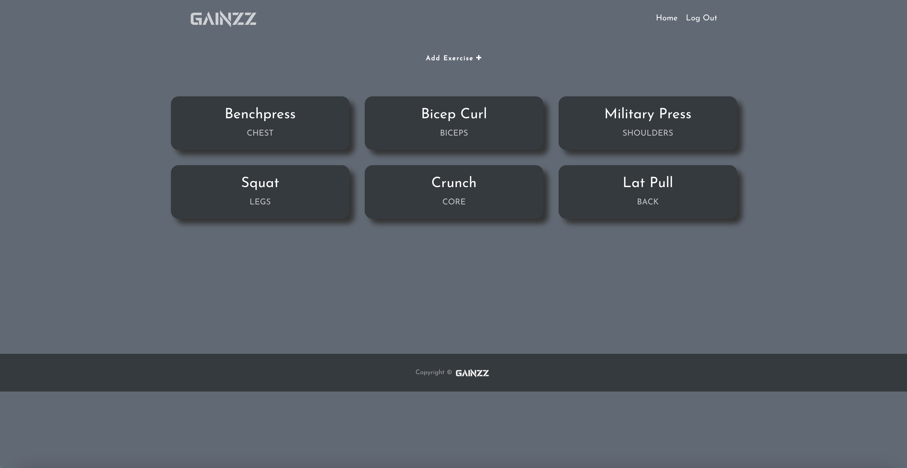

# Gainzz - Workout Planning App

## Description

This website serves as practice for creating a full-stack MERN (Mongo Express React Node) application. In this project I use React and MongoDB to create an application with user login credentials and workout creation and population functionality through back-end database interaction. You can register and login as a user, create your own exercises, and plan your workouts with details such as reps, sets, and weights.

## User Experience

Sign Up Page

Home Page

Muscle Groups Page

Add Exercise Page

List of Exercises

## Installation

The app is hosted on Heroku at this link: https://nameless-cliffs-75808.herokuapp.com/

## Usage

Enter the site to register as a user and create your own exercises, which will be categorized into different muscle groups.

## Credits

CJ Hansen, Joe Maniaci, Austyn Whaley: https://github.com/cjrhansen2
